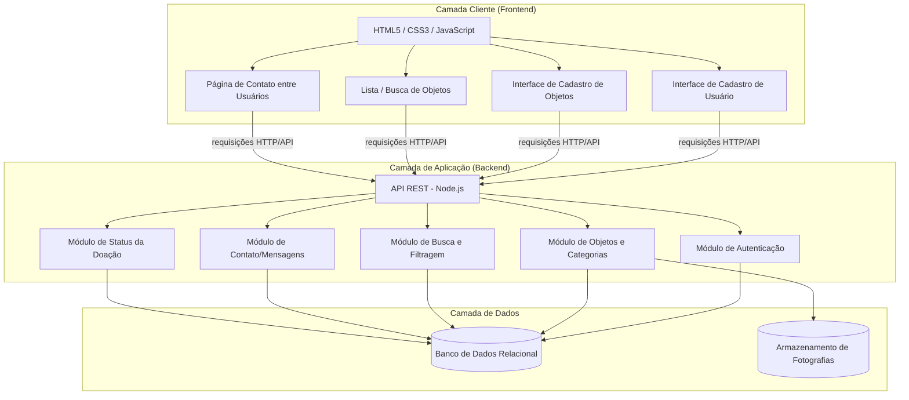
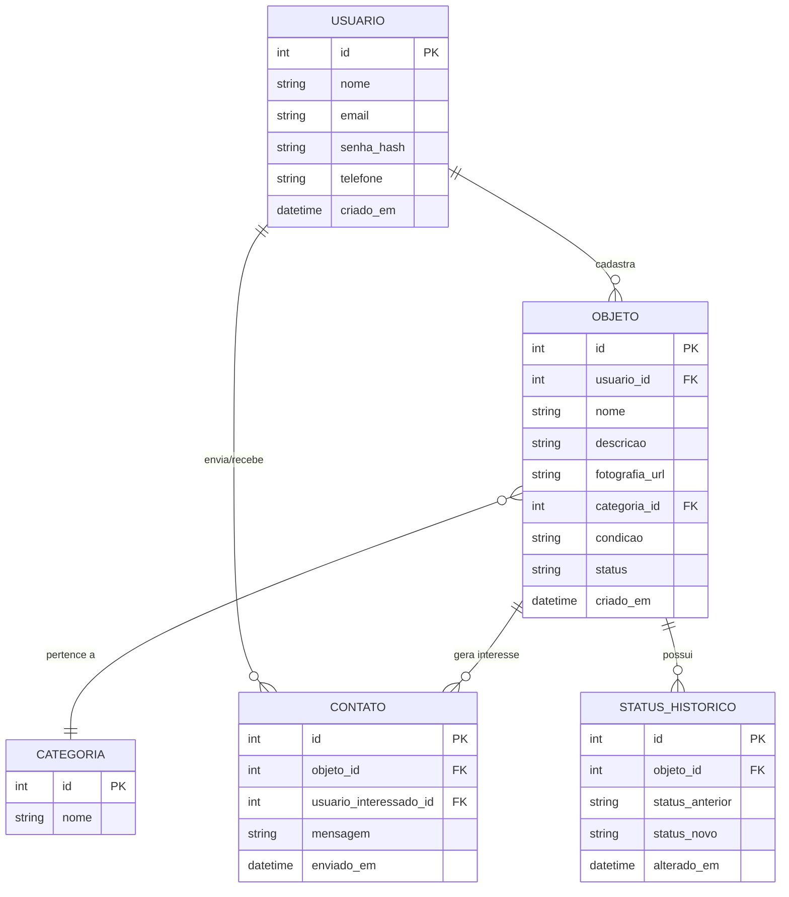
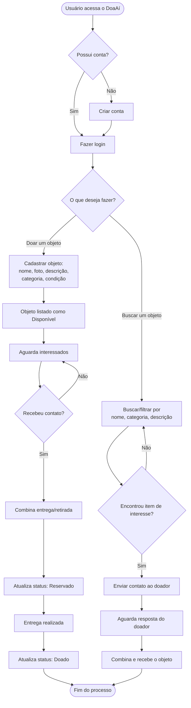
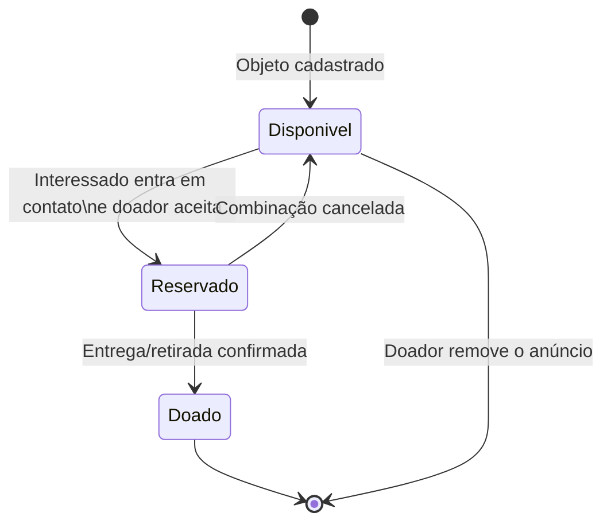
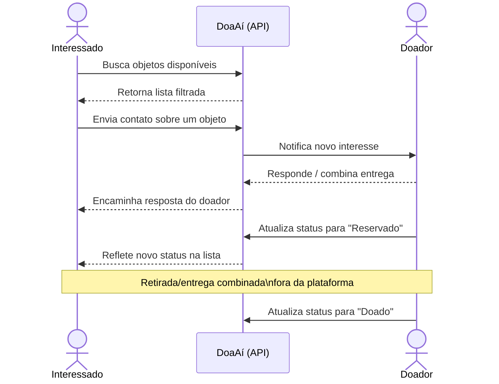

# DoaAí — Arquitetura e Modelagem do Sistema
- **Link para o Trello:** https://trello.com/b/hgIllCey/doai
---

## 1. Visão Geral da Arquitetura

Arquitetura em três camadas (frontend, backend/API e banco de dados), típica de uma aplicação web full stack com Node.js.

---

## 2. Modelo de Dados (Diagrama Entidade-Relacionamento)

Representa as principais entidades levantadas nos requisitos: usuários, objetos, categorias, contatos/mensagens e histórico de status.

---

## 3. Fluxo do Usuário (Fluxograma Geral de Uso)

Fluxo completo desde o cadastro até a conclusão de uma doação, cobrindo os dois perfis de uso: doador e interessado.

---

## 4. Ciclo de Vida do Objeto (Diagrama de Estados)

Controle de disponibilidade citado no item 9.6 dos requisitos.

---

## 5. Diagrama de Sequência — Contato entre Usuários

Detalha a interação entre interessado, doador e o sistema no momento do contato (item 9.5).

---

## 6. Rastreabilidade

Este arquivo corresponde à entrega **"Relatório de Arquitetura/Modelagem"** da Etapa 2 (Planejamento Operacional e Gestão Ágil no Trello), com vínculo aos cartões do quadro Trello e aos commits/issues correspondentes no GitHub.

- **Local no repositório:** `/docs/ARQUITETURA.md`
- **Vínculo:** cartões "Modelagem de dados", "Fluxo de uso", "Arquitetura do sistema" no quadro Trello.
- **Status do projeto:** em fase de planejamento e levantamento de requisitos — diagramas sujeitos a revisão conforme o desenvolvimento avance.

